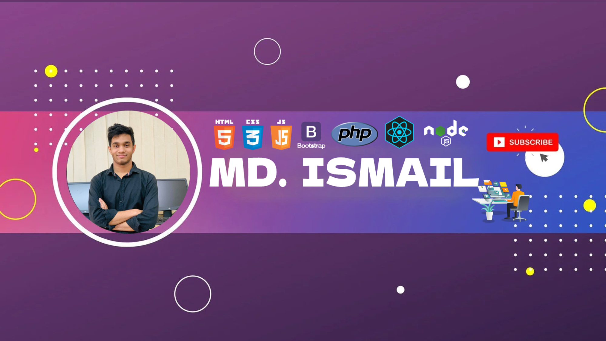

### Hi there 👋, I'm Md. Ismail
#### I'm a full-stack developer.
![I'm a full-stack developer.]

I'm a professional web designer and developer including Web Design, Website Creation, Landing Page Creation, Bootstrap, Responsive Design, Front End Development, HTML5, CSS3, PHP, Javascript, Jquery, React.js, Node.js, WordPress, eCommerce & blog website complete branding services.

Skills: REACT / NODE / HTML / CSS / JAVASCRIPT / PHP / WordPress

            

     

  

  

  

  
